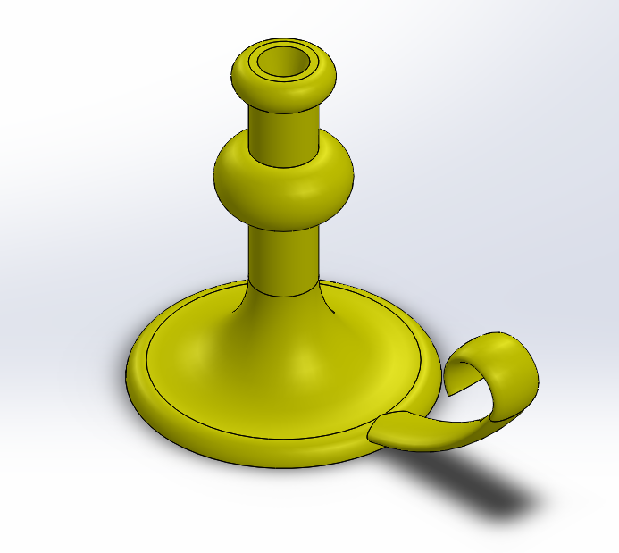

# NotSoBasicCad

# A little Practice

## Picture

here is a picture

## Description
This was the first assignment that was in SolidWorks. The assignment was called A little practice. And it was a little practice.It was pretty simple to also make. Go to SolidWorks and go to the tutorials option and look for the image that is above. Then just follow the instructions that SolidWorks tells you to do.

## Summarize
After finishing the SolidWorks instructions its should look like a 1x1 lego piece. After doing this I never realized that SolidWorks had instructions for a lot of things. That could be useful in the futer. SolidWorks is an amazing place to test your building and making skills. Its also a great place to test that skills and see if theres any flaws in it.

# Sweeps and Lofts

## Loft

## Picture

This is an image of the loft.

## Description
This was kinda similar to the last assignment. Only a bit harder. While there were instructions that didn't mean It wasn't hard. There were some parts that got a bit confusing. But it was pretty cool that it was the right shape of a hammer. Ive never made anything that complected in SolidWorks.

## Summarize
After making the loft i've felt preaty accomplished making a shape that seemed pretty hard to make. I never realise how good these tutorials were. This also helped me fine new ways on making more detailed items or shapes.

## Candle stick

## Picture
This is an image of the candle stick.

## Description
This was also hard but diffrent hard. Making something that starts wide and ends thin with a handle that was curves and has design was something I have never done. This was also my second time doing the tutorials in SolidWorks. This was easier than the loft but that didn't mean it wasn't going to be easy. It had its challenges and tools I've never heard of but hey I guess thats what the tutorials are for. Learning. Also I'm just saying stuff to make this longer cause theres really not a lot to say about this cause its the same thing only your making the something diffrent.

## Summarize
TBH these tutorials are very helpful. They teach you ways to make shapes you never thought you could make in SolidWorks. I used to think that i've reched my peek with SolidWorks but really with these tutorials i can make even better shapes. Also the way on making these shapes can be hard to do but eventually you'll get the hang of it. But theres one thing. The internet is also a tool that no tutorial tells you to use. So remeber it.
