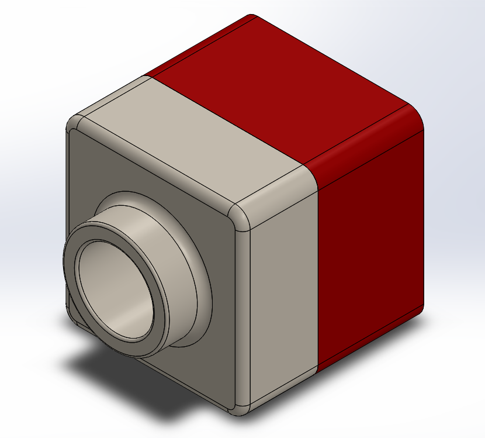

# NotSoBasicCad

# A little Practice

## Picture

here is a picture

## Description
This was the first assignment that was in SolidWorks. The assignment was called A little practice. And it was a little practice.It was pretty simple to also make. Go to SolidWorks and go to the tutorials option and look for the image that is above. Then just follow the instructions that SolidWorks tells you to do.

## Summarize
After finishing the SolidWorks instructions its should look like a 1x1 lego piece. After doing this I never realized that SolidWorks had instructions for a lot of things. That could be useful in the futer. SolidWorks is an amazing place to test your building and making skills. Its also a great place to test that skills and see if theres any flaws in it.

# Sweeps and Lofts

## Hammer head

## Picture

Heres a picture
